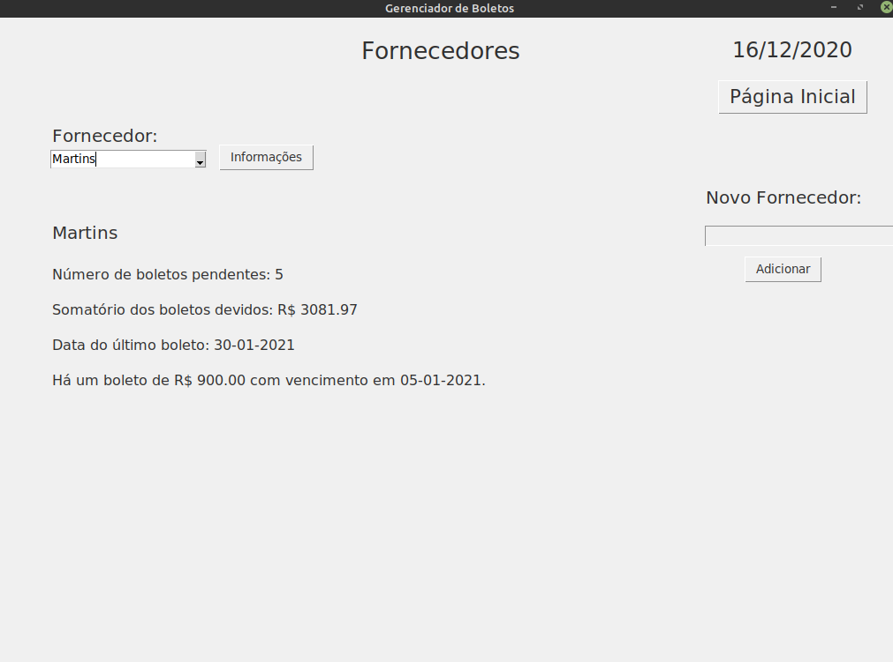

# Gerenciador de Boletos
> Ferramenta auxiliadora no controle de boletos bancários.

Este programa foi criado com o intuito de ajudar lojistas a gerenciar um razoável número de boletos bancários. A interface gráfica permite que o usuário crie uma base de dados de fornecedores e boletos. Cada boleto possui quatro informações: data de vencimento, fornecedor, valor e status de pagamento. Os boletos são exibidos no menu principal com opção de registrar o pagamento.

Com a base de dados sendo constamente alimentada, o programa retorna: somatório dos boletos devido na semana ou em qualquer outro período escolhido; somatório de boletos devidos para cada fornecedor; boleto com maior valor númerico de cada fornecedor cadastrado; somatório dos boletos pagos para qualquer período definido.

Outras screenshots podem ser vistas no arquivos .png.

## Utilização
O programa foi desenvolvido para ser usado com as versões 3.7 ou 3.8 do Python.
O primeiro passo é criar uma pasta local onde o programa será executado. Adicione criandoTabelas.py e genBoletos.py ao destino.
Execute apenas uma vez criandoTabelas.py. Nesta etapa, o banco de dados será criado. Um arquivo chamado boletos.db estará disponível. Aqui são registrados os dados.
Por fim, basta executar genBoletos.py toda vez que operar o programa. As ações ocorridas neste irão atualizar o banco de dados conforme uso.
